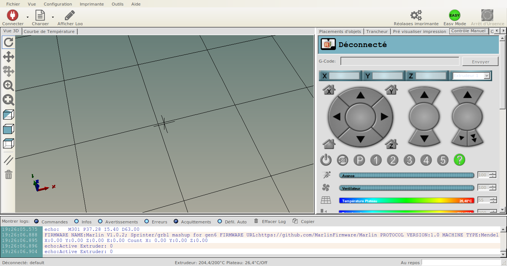
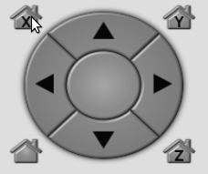
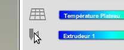
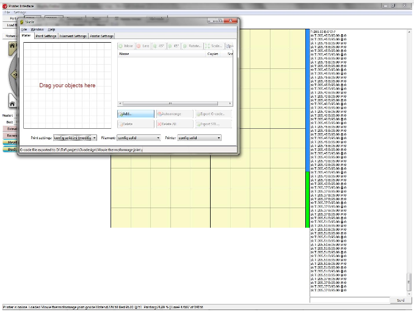

# imprimante 3D

> Création de fichiers d'impression  
	Impression supervisé si besoin

### Le Petit FabLab compte 3 imprimantes 3D.

* **Zortrax** mise à disposition par le [Pot Au Fab](http://potaufab.fr/)
* RepRap **FoldaRap** mise à disposition par Sakada
* Dagoma **DISCO EASY 200**

### Les fichiers d'objet 3D
**Logiciel de modélisation 3D (exemple)**

*Windows/Apple*
<i class="fa fa-windows"></i> <i class="fa fa-apple"></i>

* [Rhinoceros](https://www.rhino3d.com/fr/download)

*Linux/Windows/Apple*
<i class="fa fa-linux"></i> <i class="fa fa-apple"></i> <i class="fa fa-windows"></i>

* [Tinkercad](https://www.tinkercad.com/)
* [Blender](https://www.blender.org/download/)
* [Sketchup](http://www.sketchup.com/fr/download)
* [OpenSCAD](http://www.openscad.org/downloads.html)

**Téléchargement d'un fichier depuis une bibliothèque ligne**

* [thingiverse](https://www.thingiverse.com/)
* [sketchup warehouse](https://3dwarehouse.sketchup.com/)


<aside class="warning">
Vérifier que les volume soient totalement fermés et le volume max d'impression de votre machine.
</aside>

## 3D Zortrax m200

>Zortrax m200 Manual/fr  
>[voir le manuel](https://zortrax.com/wp-content/uploads/2016/07/ZORTRAX-M200-Folder.pdf)


### Aspect techniques

* Dimension: "345 x 360 x 430000 mm"
* Volume_maximum_impression: "200 x 200 x 180 mm"
* Lecteur_de_carte: oui
* Précision: 25 microns

### Format propriétaire

Edition du fichier sur logiciel Zortrax
<aside class="notice">
faire attention aux parametres de precisions  
et au type de file utiliser
</aside>

Suivant le design de la création, il se peut que les lignes de forces du volume,
mettent à mal l'impression.  
Des problemes de "courbages"et d'aparitions d'artefacts peuvent survenir.

* sauvegarder sur carte SD le fichier 3D `nom_du_fichier-temps-impression.ztl`
* charger la carte SD dans la Zortrax
* naviguer dans l'ecran LCD fichier/fichier.ztl
* lancer l'impression


## RepRap FoldaRap

>FoldaRap Build Manual/fr  
>[voir le manuel en FR](https://reprap.org/wiki/FoldaRap_Build_Manual/fr)


### Aspects techniques

* Dimension: "335 x 348 x 318 mm"
* Volume_maximum_impression: "140 x 140 x 140 mm"
* Lecteur_de_carte: non
* Précision: 50 microns


```shell
tar -xzf repetierHostLinux.tgz
cd RepetierHost
sh configureFirst.sh
sudo usermod -a -G dialout UserName
```

### Logiciel Repetier Host / Pronterface

l'installation du logiciel Repetier Host se fait sur toutes les pateformes.  

Voir les paquets sur :  
[https://www.repetier.com/download-now/](https://www.repetier.com/download-now/)

```shell
sudo apt-get install monodevelop
```

```shell
curl -O http://dl.slic3r.org/linux/slic3r-linux-x86-1-2-9-stable.tar.gz
tar zxvf slic3r-linux-x86-1-2-9-stable.tar.gz
```

>déplacer le fichier Slic3r dans le repertoire RepetierHost

```shell
mv slic3r ./RepetierHost
```

Il y a cependant 2 choses à vérifier.

* la dépendance avec [Mono Develop](http://www.mono-project.com/docs/getting-started/install/)
* l'installation du trancher [Slic3r](http://slic3r.org/download)



Brancher la FoldaRap en USB  
Mise sous tension de la FoldaRap.  

Dans RepetierHost clicker sur `connecter`  
Cliquer sur l'onglet `contrôle manuel`

>Historique et résolution des problèmes rencontrer  
>*18/09/2016* **LPFP sprint imprimantes 3D** [Blog post](https://lpfp.github.io/2016/sprint-FoldaRap-3Dprint/)

* vérifier les axes x y z
  - click sur icon `Home x/y/x`



* calibrer la temperature `Extrudeur 1` à 195°C (Suivant le type de file)
  - mettre en route la chauffe de l'extrudeur
  - attendre que la jauge arrive à 195°C
  - vérifier la fusion ...




## Dagoma Disco Easy 200

>Dagoma Disco Easy 200  
>[voir aide](https://www.lesimprimantes3d.fr/forum/41-dagoma)


>Historique et résolution des problèmes rencontrer  
>*18/09/2016* **LPFP sprint imprimantes 3D** [Blog post](https://lpfp.github.io/2016/sprint-FoldaRap-3Dprint/)

### Aspects techniques

* Dimension: "370 x 370 x 370 mm"
* Volume_maximum_impression: "200 x 200 x 200 mm"
* Lecteur_de_carte: oui (micro SD)
* Précision: 100 microns

> Installer le packet Pronterface Win ou OSX

```shell
http://www.pronterface.com/index.html#download
http://koti.kapsi.fi/~kliment/printrun/
```

> repertoire disponible sur GitHub  
	https://github.com/kliment/Printrun

```shell
# dependances:
sudo apt-get install python-serial python-wxgtk2.8 python-pyglet python-numpy cython python-libxml2 python-gobject python-dbus python-psutil python-cairosvg git

#installation depuis les sources
git clone https://github.com/kliment/Printrun.git
```


---
Brouillion

### Logiciel Pronterface / Repetier Host
Ouvrir Pronterface


Vérifier le port com04 ou 06
     la vitesse 250000
Cliquer sur le bouton «connect»
Complèment à droite, il y a une sorte de journal qui affiche toute les informations en directe venant de la machine.
Cocher la case «monitor»
Cela active les graphique de température complètement en bas à gauche.
Régler la température de la buse à 200° et du plateau à 95°.
Cliquer sur «On» pour activer la montée en température.
Pour créer le Gcode pour l’impression:
Cliquer sur «Fichier>Slicing Setting»
    La fenêtre de Sl3cer s’ouvre, chaque onglet correspond aux réglagles machines (remplissage, nombre de contour, dimensions du plateaux).
Cliquer sur Ouvrir, aller chercher le fichier stl.




### format .STL du fichier pour impression

(éclaircir le pourquoi du 3D>STL puis STL>Gcode)

Liens vers tuto pour exporter le fichier au format `.stl` ["stéréolithographie"](https://fr.wikipedia.org/wiki/Fichier_de_st%C3%A9r%C3%A9olithographie) avec  [Blender](https://www.flossmanualsfr.net/blender-pour-limpression-3d/ch018_exporter-au-format-stl-et-obj), [sketchup](https://extensions.sketchup.com/en/content/sketchup-stl)

note avec Rhinoceros:  
Avantage temps de compilation 3D>STL puis STL>Gcode mais fichier moins précis.
Avantage Solidworks fichier STL fidèle au modèle 3D temps de compilation 3D>STL très long STL>Gcode encore plus long.
<aside class="notice">
Le fichier doit tenir dans un volume max de 200x200x180 mm.  
Dans le cas contraire, prévoir un assemblage mécanique ou par collage.

Exporter en `stl` options `ASCII` (fichier moins lourd)  
Nom du fichier sans accent ni caractères spéciaux.
</aside>
