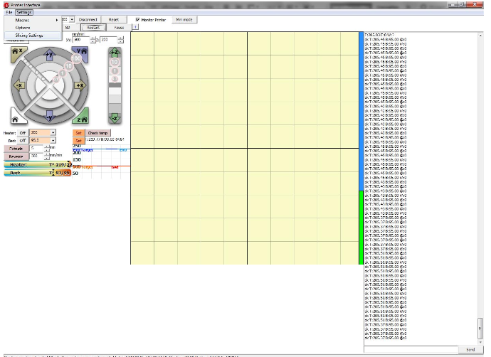
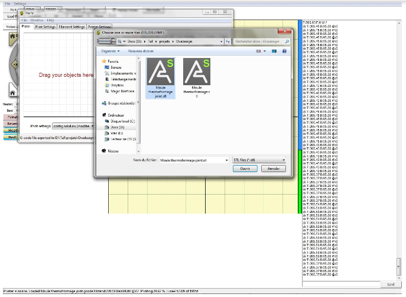

# imprimante 3D

> Création de fichiers d'impression  
	Impression supervisé si besoin

### Le Petit FabLab compte 3 imprimantes 3D.

* Zortrax mise à disposition par le [Pot Au Fab](http://potaufab.fr/)
* 2 model de Prusa_i3 modifier et assembler par ses membres

### Les fichiers d'objet 3D
**Logiciel de modélisation 3D (exemple)**

*Windows/Apple*
<i class="fa fa-windows"></i> <i class="fa fa-apple"></i>

* [Rhinoceros](https://www.rhino3d.com/fr/download)

*Linux/Windows/Apple*
<i class="fa fa-linux"></i> <i class="fa fa-apple"></i> <i class="fa fa-windows"></i>

* [Blender](https://www.blender.org/download/)
* [Sketchup](http://www.sketchup.com/fr/download)
* [OpenSCAD](http://www.openscad.org/downloads.html)

**Téléchargement d'un fichier depuis une bibliothèque ligne**

* [thingiverse](https://www.thingiverse.com/)
* [sketchup warehouse](https://3dwarehouse.sketchup.com/)

Vérifier les volume max d'impression de votre machine.
<aside class="warning">
Les volumes doivent être totalement fermés.  
Les dépouilles doivent faire au maximum 110°
</aside>

## 3D Zortrax m200

### Aspect techniques

* Dimension: "345 x 360 x 430000 mm"
* Volume_maximum_impression: "200 x 200 x 180 mm"
* Lecteur_de_carte: oui
* Précision: 25Micron

### format .STL du fichier pour impression

(éclaircir le pourquoi du 3D>STL puis STL>Gcode)

Liens vers tuto pour exporter le fichier au format `.stl` ["stéréolithographie"](https://fr.wikipedia.org/wiki/Fichier_de_st%C3%A9r%C3%A9olithographie) avec  [Blender](https://www.flossmanualsfr.net/blender-pour-limpression-3d/ch018_exporter-au-format-stl-et-obj), [sketchup](https://extensions.sketchup.com/en/content/sketchup-stl)

note avec Rhinoceros:  
Avantage temps de compilation 3D>STL puis STL>Gcode mais fichier moins précis.
Avantage Solidworks fichier STL fidèle au modèle 3D temps de compilation 3D>STL très long STL>Gcode encore plus long.
<aside class="notice">
Le fichier doit tenir dans un volume max de 200x200x180 mm.  
Dans le cas contraire, prévoir un assemblage mécanique ou par collage.

Exporter en `stl` options `ASCII` (fichier moins lourd)  
Nom du fichier sans accent ni caractères spéciaux.
</aside>


> Installer le packet Pronterface Win ou OSX

```shell
http://www.pronterface.com/index.html#download
http://koti.kapsi.fi/~kliment/printrun/
```

> repertoire disponible sur GitHub  
	https://github.com/kliment/Printrun

```shell
# dependances:
sudo apt-get install python-serial python-wxgtk2.8 python-pyglet python-numpy cython python-libxml2 python-gobject python-dbus python-psutil python-cairosvg git

#installation depuis les sources
git clone https://github.com/kliment/Printrun.git
```


### (role de Pronterface. console d'impression?
Ouvrir Pronterface



Vérifier le port com04 ou 06
     la vitesse 250000
Cliquer sur le bouton «connect»
Complèment à droite, il y a une sorte de journal qui affiche toute les informations en directe venant de la machine.
Cocher la case «monitor»
Cela active les graphique de température complètement en bas à gauche.
Régler la température de la buse à 200° et du plateau à 95°.
Cliquer sur «On» pour activer la montée en température.
Pour créer le Gcode pour l’impression:
Cliquer sur «Fichier>Slicing Setting»
    La fenêtre de Sl3cer s’ouvre, chaque onglet correspond aux réglagles machines (remplissage, nombre de contour, dimensions du plateaux).
Cliquer sur Ouvrir, aller chercher le fichier stl.



