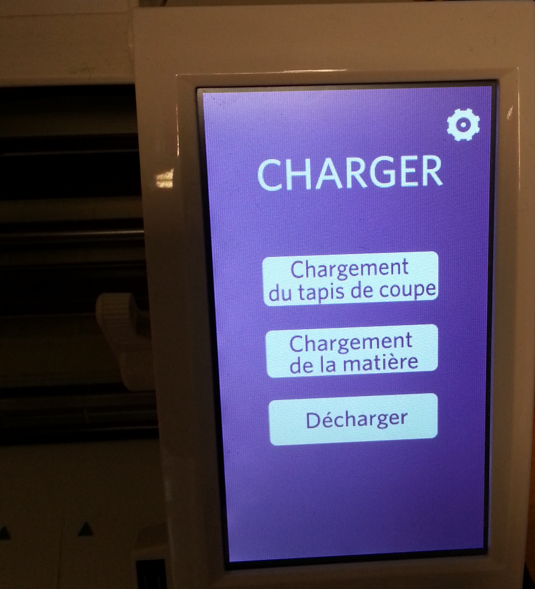

# Découpeuse vinyle

  
**Shilhouette CAMEO**

>Aide Manuel CAMEO  
>[http://edutechwiki.unige.ch/en/Silhouette_Cameo](http://edutechwiki.unige.ch/en/Silhouette_Cameo)

### Aspect techniques

* Format papier/vinyle max: A3
* Largeur du tapis: 30.5 cm
* connection: USB

### Logiciel et fichiers

>Logiciel propriétaire Silhouette  
>[http://silhouetteamerica.com/software](http://silhouetteamerica.com/software)

**Logiciel de dessin et d'impression**  
Silhouette Studio®

**Logiciel de dessin vectoriel (exemple)**

*Windows/Apple*  
[Illustrator](http://www.adobe.com/fr/products/illustrator.html)

```shell
sudo apt-get install inkscape
```

*Windows/Apple/Linux*  
[Inkscape](https://inkscape.org/fr/telecharger/)

Dans un souci de détail, essayez de penser à travailler une couleur à la fois et à économiser de la matière par rapport à l'agencement de vos formes.
<aside class="warning">
Attention, tous les traits seront découpés.  
Pensez à combiner les formes et à vectoriser les polices et les tracés.  
Les textes en dessous de 5mm de haut seront très fastidieux à mettre en place
</aside>

Tips sur Inkscape
<aside class="notice">
voir les tracés en pressant `Ctrl+Y`.  
Si vos traits sont séparés, vous pouvez les combiner en utilisant la commande "contour en chemin" `Ctrl-Alt-C`.
</aside>

### Envoyer le fichier pour la découpe



* allumage
* ecran LCD: `chargement du tapis de coupe`
* Logiciel Shilhouette (charger/faire le .SVG):
  - cliquer sur `parametre de découpeuse` (standard ou avancer)
* ecran LCD découpeuse: cliquer sur `envoyer vers silhouette`
* attendre que la découpe se finisse
* ecran LCD découpeuse: cliquer sur `décharger`

>Piste pour robocut Linux  
>http://robocut.org/  
>https://github.com/nosliwneb/robocut/issues  
>https://github.com/Timmmm/robocut  
>http://custom.ultramini.net/robocut-compatible-with-silhouette-cameo/

```shell
sudo apt-get install libqt4-dev libusb-1.0-0-dev
git clone https://github.com/LPFP/robocut.git
cd robocut
qmake-qt4
make
sudo adduser UserName lp
sudo cp Robocut /usr/local/bin
robocut
```

### Installation Linux Robocut pour la CAMEO

Si l'installation ne marche pas avec le model CAMEO
il faut modier avec:

* forker le repo git robocut
* modifier le fichier `Plotter.h` ligne 53

`const int PRODUCT_ID_SILHOUETTE_CAMEO =  0x1121;`  
par  
`const int PRODUCT_ID_SILHOUETTE_CAMEO =  0x112B;`

*si non voir les commentaires des fichiers Plotter et vérifier les informations et ID de la CAMEO dont vous disposez.*
